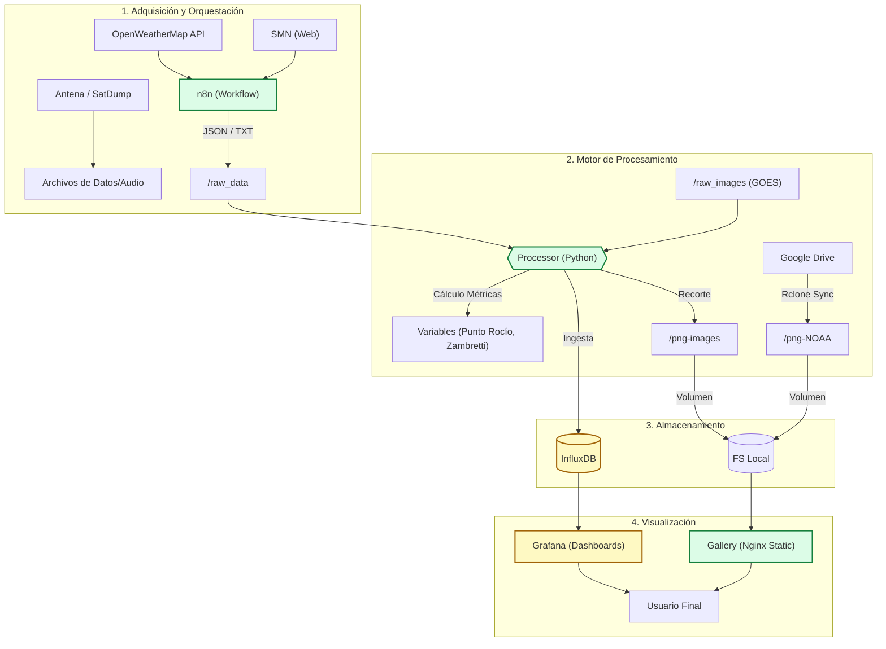

# NOAA Climate Information System

Este proyecto implementa el sistema de procesamiento y visualización de datos e imágenes satelitales (GOES/NOAA) y telemetría meteorológica (SMN/OpenWeatherMap).

## 🏗️ Arquitectura del Proyecto

El sistema está diseñado para capturar, procesar y visualizar datos meteorológicos de diversas fuentes en tiempo real.



## 🚀 Componentes del Sistema

1.  **n8n**: Orquestador encargado de descargar datos de OpenWeatherMap y SMN.
2.  **Processor (Custom)**: Motor en Python que monitorea directorios:
    *   **GOES**: Recorta imágenes de satélite GOES-19 enfocándose en la región de Córdoba.
    *   **Telemetría**: Parsea datos de SMN y OWM para enviarlos a InfluxDB.
    *   **Métricas**: Calcula índices como el Punto de Rocío y el Pronóstico Zambretti.
    *   **Sincronización**: Descarga imágenes NOAA procesadas desde Google Drive vía Rclone.
3.  **InfluxDB**: Base de datos de series temporales para telemetría y predicciones.
4.  **Grafana**: Visualización de datos meteorológicos mediante tableros pre-configurados.
5.  **Gallery (Nginx)**: Interfaz web simple para visualizar las imágenes recortadas de GOES y NOAA.

## 📂 Estructura de Directorios

*   `raw_data/`: Datos crudos (JSON/TXT/ZIP) de SMN y OWM.
*   `raw_images/`: Imágenes satelitales GOES sin procesar.
*   `png-images/`: Imágenes GOES recortadas (Córdoba).
*   `png-NOAA/`: Imágenes satelitales NOAA sincronizadas desde la nube.
*   `configs/`: Configuraciones de n8n, dashboards de Grafana y tokens.

## ⚙️ Despliegue Rápido

1.  **Requisitos**: Docker y Docker Compose v2+.
2.  **Configuración**:
    ```bash
    cp .env.template .env
    # Edita el .env con tu OPENWEATHERMAP_API_KEY
    ```
3.  **Ejecución**:
    ```bash
    chmod +x setup.sh
    ./setup.sh
    ```

## ⚓ Puertos y Acceso

| Servicio | URL | Descripción |
| :--- | :--- | :--- |
| **n8n** | `http://localhost:5678` | Workflows y automatización |
| **Grafana** | `http://localhost:3000` | Tableros meteorológicos (admin/admin) |
| **Galería** | `http://localhost:8080` | Imágenes satelitales (GOES/NOAA) |
| **InfluxDB** | `http://localhost:8086` | Consola de base de datos |

---
*Este proyecto está diseñado para funcionar de manera autónoma una vez configurado el archivo `.env`.*
