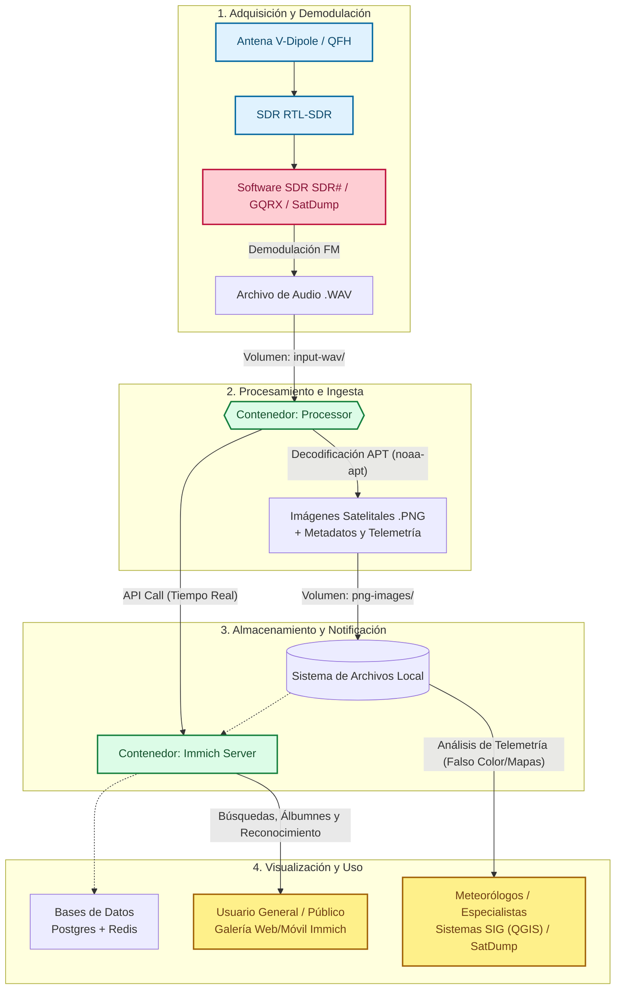

# NOAA Climate Information System

Este proyecto implementa el sistema de procesamiento y visualización de imágenes satelitales NOAA, tal como se especifica en el PRD.
## Arquitectura del Proyecto

El sistema está diseñado en una serie de bloques que abarcan desde la recepción de la señal de radio hasta su procesamiento y posterior visualización. A continuación se presenta un diagrama general de la infraestructura:



## Componentes del Entorno Docker

Contiene los siguientes componentes integrados a través de Docker Compose:

1. **Processor (noaa-apt)**: Contenedor hecho a medida que corre `noaa-apt` y `inotifywait`. Vigila la carpeta `input-wav`, decodifica los archivos de audio `wav` (señales APT), genera las imágenes correspondientes, las guarda en `png-images` y elimina archivos `.wav` viejos.
2. **Immich**: Galería fotográfica en la que se configuran "Librerías Externas" conectadas a la carpeta `png-images`. Posibilita la organización y visualización de las imágenes.
3. **n8n**: Orquestador de flujos de trabajo listo para descargar imágenes de repositorios externos en el futuro y depositarlas en `png-images`.
4. **Postgres y Redis**: Bases de datos y caché en memoria para ejecutar Immich.

## Estructura de Directorios Clave

* `input-wav/`: Carpeta en el filesystem local. Los WAV generados por SDR deben ser guardados aquí.
* `png-images/`: Las imágenes decodificadas y descargadas por n8n se exponen y visualizan aquí. Immich lee de este volumen y muestra todo de manera indexada.

## Cómo Ejecutar Todo el Proyecto

La forma recomendada de desplegar toda la infraestructura desde cero es mediante el script de configuración automatizado. Este script se encargará de validar dependencias, crear los directorios necesarios (ignorados en git) y levantar docker compose.

1. Asegúrate de tener instalado `docker` y `docker compose`.
2. Clona (o desplázate con `cd`) al directorio que contiene el proyecto.
3. Copia el archivo `.env.template` y renómbralo a `.env`. Dentro de este archivo puedes modificar cualquier parámetro o directorio de configuración según tus necesidades.
   ```bash
   cp .env.template .env
   ```
4. Ejecuta el entorno inicial. El script aplicará todas las configuraciones definidas en tu archivo `.env`:

```bash
./setup.sh
```

*(Si utilizas Windows, el equivalente provisto es `./setup.ps1`)*

El script descargará las imágenes correspondientes, creará las carpetas locales requeridas y ejecutará el `processor` personalizado usando las variables de entorno definidas.

## Configuración Inicial y Sincronización en Tiempo Real

Para que el sistema funcione de forma completamente autónoma y en **tiempo real**, Immich y el Procesador necesitan comunicarse a través de la API.

### 1. Preparar la Librería en Immich
1. Ingresa a `http://localhost:2283` (o la IP de tu host) en el navegador y crea tu usuario administrador.
2. Ve a **Administration -> Settings -> Libraries -> Create Library**.
3. Haz clic en **External Library**, ponle un nombre (ej. "Imágenes NOAA").
4. Selecciona la ruta `/png-output` (previamente mapeada en nuestro `docker-compose.yml`).
5. (Opcional) Puedes configurar un "Scan Schedule", aunque ya no es estrictamente necesario gracias a la comunicación vía API en tiempo real que configuraremos a continuación.

### 2. Configurar la API Key para la Sincronización Inmediata
El contenedor `processor` está diseñado para avisarle a Immich cada vez que decodifica una imagen nueva o cuando eliminas alguna de la carpeta. Para que esto funcione:
1. Dentro de Immich, haz clic en tu foto de perfil (arriba a la derecha) -> **Account Settings -> API Keys**.
2. Genera una nueva API Key ("New API Key").
3. En tu sistema de archivos local, crea la carpeta `configs` (si no existe) y dentro de ella un archivo llamado `token`. 
4. Pega la clave generada dentro de ese archivo `configs/token` (ej. `/home/user/proyecto/configs/token`).
5. Reinicia el contenedor del procesador: `docker compose restart processor`.

### ¿Cómo funciona la sincronización interna?
El script `entrypoint.sh` dentro del **Processor**:
- Utiliza `inotifywait` para monitorear constantemente la carpeta de entrada (`input-wav`) y la carpeta de salida (`png-images`).
- **Nuevas imágenes**: Al decodificar un audio con `noaa-apt` y generar el PNG, lee tu `token`, consulta todos los IDs de tus librerías externas mediante la API de Immich (`GET /api/libraries`) y dispara automáticamente una orden de escaneo (`POST /api/libraries/<id>/scan`). La imagen aparece en Immich en milisegundos.
- **Borrados**: Si borras o mueves un archivo PNG de la carpeta contenedora, el Procesador lo detecta y dispara una orden de limpieza (`POST /api/libraries/<id>/removeOffline`), manteniendo el "caché" interno de la base de datos de Immich 100% fiel a tu sistema de archivos.

¡Eso es todo! El sistema operará continuamente de forma autónoma y mantendrá tu galería fotográfica perfectamente sincronizada en tiempo real.
