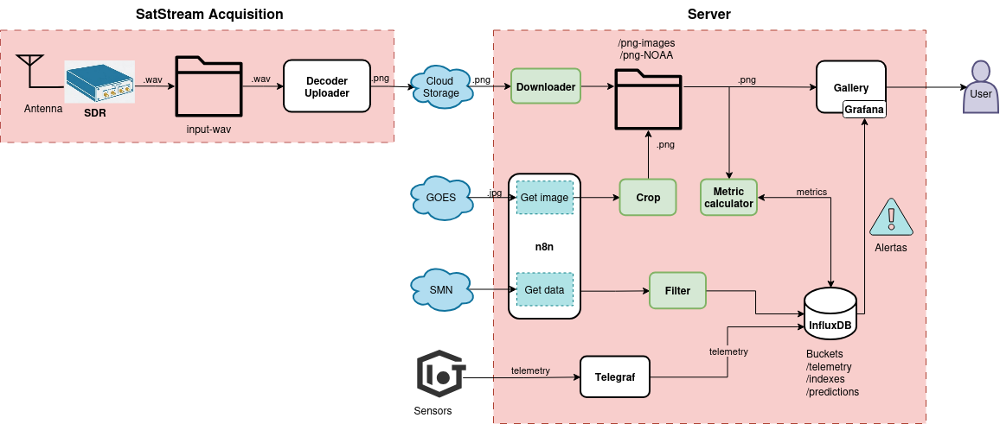
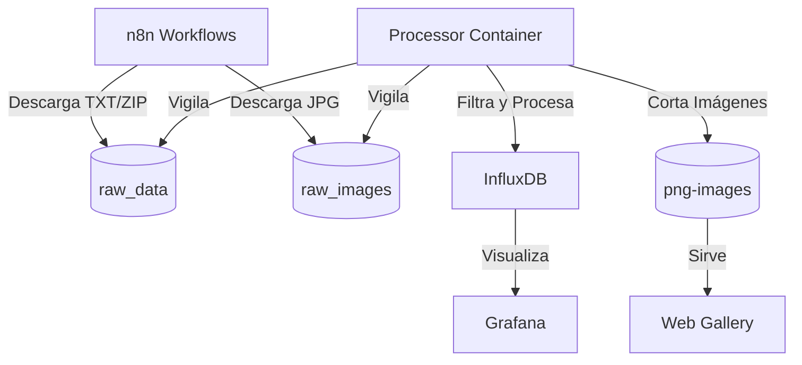

# Arquitectura del Sistema

El sistema funciona como un conjunto de microservicios orquestados por Docker Compose, donde el núcleo es el intercambio de archivos a través de volúmenes compartidos.

## 🏗️ Diagrama de Flujo de Datos

## 📂 Estructura de Directorios Clave

- `/configs`: Configuraciones de Grafana, InfluxDB y Rclone.
- `/raw_data`: Directorio de entrada para datos crudos (TXT, ZIP, JSON).
- `/raw_images`: Directorio de entrada para imágenes GOES originales.
- `/png-images`: Imágenes recortadas y procesadas listas para la web.
- `/processor`: Código fuente del motor de procesamiento en Python.

## ⚙️ Componentes

### 1. InfluxDB
Motor de base de datos de series temporales. Utiliza dos buckets principales:
- `telemetry`: Datos de estaciones meteorológicas (SMN, OWM).
- `predictions`: Resultados del algoritmo de Zambretti y métricas calculadas.

### 2. Processor (Python Engine)
Contenedor dedicado que ejecuta tres tipos de tareas:
- **Workers Inotify**: Reaccionan instantáneamente cuando n8n guarda un archivo en el disco.
- **Cron Jobs**: Tareas programadas como el cálculo de índices cada hora.
- **OpenCV Engine**: Encargado del tratamiento de imágenes satelitales.

### 3. n8n
Cerebro de la automatización. Se encarga de conectarse a servidores FTP del SMN, APIs de OpenWeatherMap y repositorios de Amazon S3 (NOAA Big Data).
