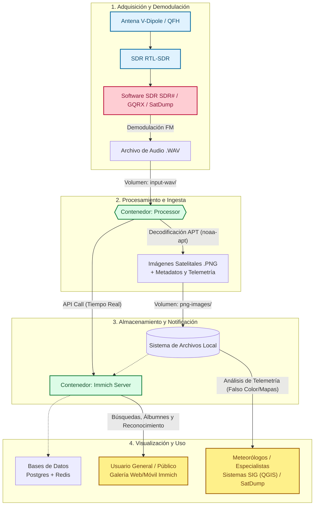

# Arquitectura del Sistema NOAA

El sistema está diseñado en una serie de bloques que abarcan desde la recepción de la señal de radio hasta su procesamiento y posterior visualización. A continuación se presenta el diagrama general de la infraestructura:

## Componentes del Entorno Docker

El sistema se compone de los siguientes contenedores principales que interactúan entre sí:

* **Processor (noaa-apt):** Es el corazón del procesamiento. Detecta instantáneamente nuevos archivos de audio, los convierte a imágenes y notifica a la galería.
* **Immich:** Provee una interfaz tipo "Google Photos" para el público general.
* **Bases de Datos:** PostgreSQL y Redis almacenan los metadatos fotográficos y optimizan las consultas.
* **n8n:** Orquestador reservado para automatizaciones futuras (ej. descargas en la nube).
