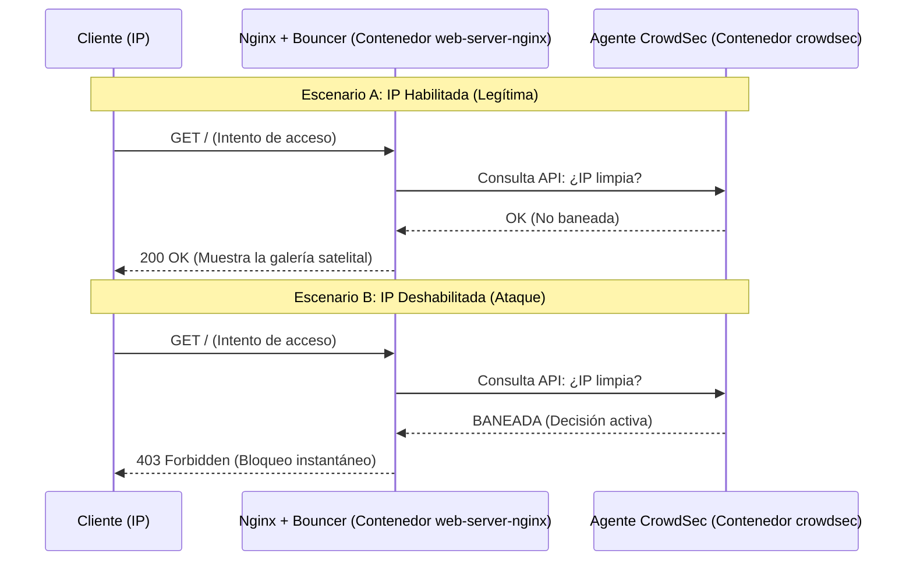

# Observabilidad y Seguridad (PLG + CrowdSec)

Este módulo describe la arquitectura de telemetría y protección activa implementada en el Sistema de Información Climática. El objetivo principal es mantener una visibilidad total sobre los contenedores y proteger la aplicación web (la galería de imágenes) frente a ataques automatizados, todo sin comprometer la filosofía de contenedores sin privilegios root.

## Arquitectura de Observabilidad (Stack PLG)

El sistema centraliza los registros (logs) de todos los contenedores utilizando el ecosistema PLG, que destaca por su eficiencia y bajo consumo de recursos al no indexar el texto completo, sino apoyarse en etiquetas (*labels*).

### 1. Promtail (Recolector)
Promtail actúa como un agente en segundo plano. Mediante acceso de solo lectura al socket de Docker (`/var/run/docker.sock`), captura la salida estándar (`stdout`/`stderr`) de cada uno de los contenedores del proyecto.
*   **Etiquetado Automático:** Promtail añade metadatos vitales a cada línea de log, como el ID del contenedor, el nombre del servicio de Compose (`compose_service`) y la imagen utilizada.
*   **Envío:** Transfiere los logs procesados hacia Loki en tiempo real.

### 2. Loki (Almacenamiento y Motor)
Loki es el cerebro de los logs. Recibe el flujo de Promtail, lo comprime en bloques de tiempo y lo guarda en el almacenamiento persistente.
*   **Almacenamiento Local (Sin Root):** Para cumplir con las normativas de seguridad, el volumen de Loki (`/tmp/loki`) está montado mediante un *Bind Mount* hacia la carpeta del host `./loki-data`. Esta carpeta es gestionada con permisos `777` en el script inicializador, permitiendo que el usuario interno de Loki (`uid: 10001`) almacene la información sin necesidad de que el contenedor requiera privilegios `root`.
*   **Compactor:** Se encuentra configurado para limpiar y retener logs por un máximo de 7 días, garantizando que el almacenamiento del servidor no se sature.

### 3. Grafana (Visualización)
Actúa como la única interfaz gráfica del proyecto. Además de mostrar los dashboards del clima (vía InfluxDB), permite la exploración de logs utilizando el lenguaje **LogQL**. Los administradores pueden acceder a la pestaña *Explore* para correlacionar eventos de errores climáticos con fallos en los contenedores.

---

## Arquitectura de Seguridad (CrowdSec)

Para asegurar la interfaz web, implementamos CrowdSec, un Sistema de Prevención de Intrusiones (IPS) moderno y colaborativo. 

Para mantener la estricta filosofía de Docker de "un proceso por contenedor", la arquitectura de seguridad se dividió en dos partes fundamentales: el **Cerebro (Agente)** y el **Músculo (Bouncer)**. Esta división garantiza que el bloqueo se realice **dentro** del contenedor web, sin necesidad de modificar el firewall del servidor físico (host).

### 1. El Agente (Contenedor `crowdsec`)
Es el motor centralizado de análisis y vive en su propio contenedor. Su trabajo principal consiste en:
*   **Leer pasivamente:** Escucha el socket de Docker para leer los logs en tiempo real sin interferir con el tráfico normal.
*   **Inteligencia Local y Colectiva:** Evalúa patrones de ataque (ej. escaneo de puertos, fuerza bruta) y descarga constantemente una "Lista Negra Global" mantenida por la comunidad.
*   **Base de Datos:** Almacena la lista de IPs maliciosas detectadas y proporciona una API local (LAPI) para que otros contenedores la consulten. **El agente no bloquea el tráfico por sí mismo.**

### 2. El Bouncer (Dentro del contenedor `web-server-nginx`)
El componente de aplicación (el verdadero firewall) reside directamente **dentro del servidor web Nginx**.
*   Se compiló el módulo oficial `crowdsec-nginx-bouncer` en la imagen del contenedor `web-server-nginx`.
*   El Bouncer intercepta cada solicitud web justo en la puerta de entrada de Nginx.
*   Pregunta al Agente (vía LAPI) si la IP entrante está permitida.
*   Al bloquear, devuelve un error `403 Forbidden` a nivel de aplicación HTTP, protegiendo al sistema de procesamiento innecesario y **sin tocar `iptables` en la máquina host**.

---

## Flujo de Solicitudes (Paso a Paso)

A continuación, se detalla qué sucede en cuestión de milisegundos cuando una dirección IP interactúa con el servidor.

### Escenario A: Solicitud de una IP Habilitada (Tráfico Legítimo)

1. **Llegada:** Un usuario legítimo (ej. `203.0.113.5`) intenta acceder a `http://tu-servidor:8080/`.
2. **Intercepción del Bouncer:** Nginx recibe la petición, pero antes de procesar o mostrar la galería web, el *Nginx Bouncer* pausa la solicitud.
3. **Consulta (LAPI):** El Bouncer hace una consulta HTTP súper rápida al contenedor de `crowdsec` preguntando: *"¿La IP 203.0.113.5 está bloqueada?"*.
4. **Respuesta del Agente:** El Agente revisa su base de datos en memoria y responde: *"No hay decisiones en contra de esa IP"*.
5. **Acceso Permitido:** El Bouncer aprueba el paso. Nginx carga el HTML, las imágenes satelitales y devuelve un código de estado `200 OK` al usuario.
6. **Registro Pasivo:** El Agente CrowdSec sigue leyendo los logs de Nginx en segundo plano. Como el comportamiento es normal, no toma ninguna acción punitiva.

### Escenario B: Solicitud de una IP Deshabilitada (Ataque)

1. **Llegada:** Una red de bots (ej. `198.51.100.22`) intenta acceder masivamente o buscar vulnerabilidades.
2. **Intercepción del Bouncer:** Nginx recibe la primera petición. El *Nginx Bouncer* intercepta la solicitud.
3. **Consulta (LAPI):** El Bouncer consulta al contenedor de `crowdsec`: *"¿La IP 198.51.100.22 está bloqueada?"*.
4. **Respuesta del Agente:** El Agente detecta que la IP está en la lista negra global (o fue baneada localmente por ataques previos) y responde: *"SÍ, IP bloqueada (Ban)"*.
5. **Bloqueo Inmediato:** El Bouncer **destruye** la solicitud instantáneamente. Nginx **no** procesa ningún archivo web ni accede al disco, sino que responde con un código `HTTP 403 Forbidden` de inmediato.
6. **Protección Continua:** Cualquier intento posterior de esa IP es bloqueado en milisegundos sin consumir recursos de CPU, ya que el Bouncer mantiene una pequeña memoria caché de las respuestas del Agente para ser aún más rápido.



---

## Guía de Verificación y Administración (Cheatsheet)

Como administrador del sistema, puedes auditar y gestionar el entorno de seguridad y observabilidad utilizando los siguientes comandos directamente desde la terminal del servidor.

### Gestión de CrowdSec
Todos los comandos de CrowdSec se ejecutan comunicándose con el agente interno mediante Docker Compose.

*   **Ver reglas (escenarios) activos:** Enumera todas las reglas de ataque y vulnerabilidades que el sistema está vigilando activamente.
    ```bash
    docker compose exec crowdsec cscli scenarios list
    ```
*   **Ver métricas internas:** Muestra estadísticas en tiempo real sobre cuántas líneas de log se han leído y cuántas peticiones se han excluido o procesado.
    ```bash
    docker compose exec crowdsec cscli metrics
    ```
*   **Ver estado del Bouncer:** Verifica que el agente de Nginx está correctamente conectado y registrado en el motor de seguridad.
    ```bash
    docker compose exec crowdsec cscli bouncers list
    ```

### Simulacro y Gestión de Bloqueos (Baneos)
*   **Bloquear una IP manualmente:** Útil para realizar simulacros de seguridad (ej. bloquear localhost) o sancionar una IP conocida.
    ```bash
    docker compose exec crowdsec cscli decisions add -i 127.0.0.1 -d 1h
    ```
*   **Ver IPs bloqueadas localmente:** (No muestra la lista masiva de la comunidad para evitar saturar la terminal).
    ```bash
    docker compose exec crowdsec cscli decisions list
    ```
*   **Retirar bloqueo de una IP:** Elimina una IP de la lista negra local para restaurar su acceso.
    ```bash
    docker compose exec crowdsec cscli decisions delete -i 127.0.0.1
    ```

### Monitoreo del Stack PLG
*   **Explorar logs visualmente:** Ingresa a `http://localhost:3000` (Grafana), ve a la pestaña **Explore**, selecciona el Data Source **Loki** y utiliza **LogQL** para filtrar por aplicación. Ejemplo: `{compose_service="web-server-nginx"}`.
*   **Auditar estado de Promtail:** Si los logs no parecen estar llegando a la interfaz, verifica si el recolector tiene errores leyendo el socket de Docker.
    ```bash
    docker compose logs -f promtail
    ```
*   **Auditar estado de Loki:** Útil si hay problemas de lectura/escritura en disco o de persistencia local.
    ```bash
    docker compose logs -f loki
    ```

---

## Troubleshooting Frecuente (Solución de Problemas)

Durante la implementación y pruebas de CrowdSec en un entorno Docker, es común encontrarse con ciertos comportamientos que parecen errores pero son características naturales de la arquitectura de red de contenedores.

### 1. Error de Nginx: `no resolver defined to resolve "crowdsec"`

**Síntoma:** Al revisar los logs de `web-server-nginx` (`docker compose logs web-server-nginx`), observas que el Bouncer falla al consultar la API con un error similar a: `failed to query LAPI http://crowdsec:8080... no resolver defined`.

### Solución al DNS
**Solución:** Se debe instruir a Nginx explícitamente para que utilice el servidor DNS interno de Docker (siempre `127.0.0.11`). Esto se logró añadiendo la siguiente directiva dentro del bloque `server {}` en `configs/web-server-nginx/default.conf`:
```nginx
# Resolver DNS interno de Docker (necesario para el módulo Lua de CrowdSec)
resolver 127.0.0.11 valid=30s ipv6=off;
```

### 2. Un baneo manual a `127.0.0.1` no tiene efecto al probar con `curl`

**Síntoma:** Ejecutas `cscli decisions add -i 127.0.0.1`, luego haces un `curl -I http://localhost:8080/` desde la terminal del servidor host, pero Nginx sigue respondiendo `200 OK` en lugar de rebotarte con un `403 Forbidden`.

**Causa (El "Docker Proxy"):** Cuando realizas peticiones locales hacia un puerto expuesto en `docker-compose.yml` (ej. `8080:8080`), la petición no viaja directamente a Nginx conservando tu IP `127.0.0.1`. En su lugar, el tráfico pasa obligatoriamente por el proxy de red de Docker (que mapea los puertos). 
Como resultado de este intermediario, Nginx percibe que la petición proviene de la **dirección IP de la puerta de enlace (Gateway) de la red virtual de Docker** (por ejemplo, `172.18.0.1`), y no de tu máquina local. Cuando el Bouncer le pregunta al Agente si `172.18.0.1` está baneada, la respuesta es "No", y te permite el paso.

**Cómo comprobarlo de forma efectiva:**
1. Revisa los logs de acceso de Nginx (`docker compose logs web-server-nginx`). Verás que la IP del cliente real que Nginx registró es la del Gateway de Docker (ej. `172.18.0.1 - - [Fecha] "GET / HTTP/1.1"`).
2. Para hacer una prueba de baneo exitosa desde la terminal de tu host, debes banear a ese "intermediario" de Docker que observaste en los logs:
   ```bash
   docker compose exec crowdsec cscli decisions add -i 172.18.0.1 -d 5m
   ```
   Al repetir el `curl`, verás que el sistema te rechaza correctamente con un `403 Forbidden`.

> [!NOTE]
> En un entorno de producción real donde el servidor esté expuesto a Internet detrás de un Proxy Inverso (como Nginx Proxy Manager o Cloudflare), esta configuración deberá complementarse utilizando cabeceras HTTP como `X-Forwarded-For` para asegurar que el Bouncer bloquee las IPs reales de los usuarios externos y no la IP del proxy.
